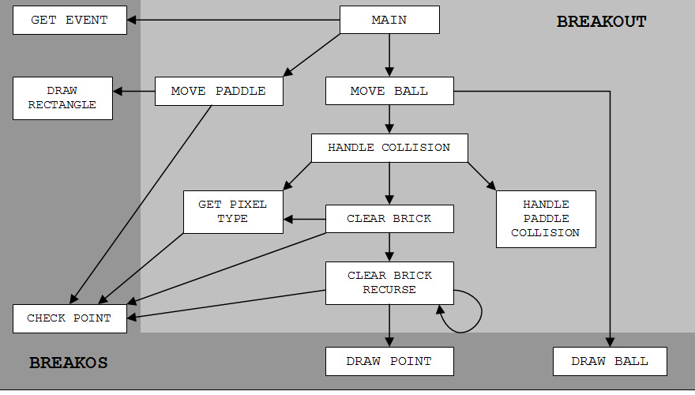

# Breakout-Ball-Game 

Breakout Ball is a game developed using the concepts of java like Frames, Swings.

## Project Stages

1. Create a Java project using Command Line App.

2. Design the project structure.

3. Once the project is set, design the window terminal frame.

4. Design the entire background by setting the dimensions, colour, focus and object count.

5. Implement the actions of the keys and the objects.

## Context
Breakout Ball game is a widely used game which was developed in the 1970s. In Breakout, a layer of bricks lines the top third of the screen and the goal is to destroy them all. A ball moves straight around the screen, bouncing off the top and two sides of the screen. When a brick is hit, the ball bounces back and the brick is destroyed. The player loses a turn when the ball touches the bottom of the screen; to prevent this from happening, the player has a horizontally movable paddle to bounce the ball upward, keeping it in play. The player uses the platform to keep the ball running. The goal is to break the bricks without missing the ball with your platform.

## Architecture Diagram

